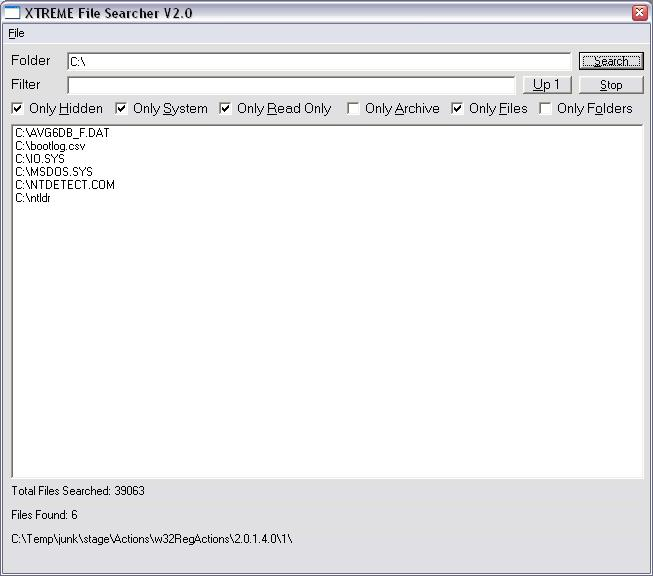



## \_\_\_ULTIMATE FILE SEARCHER 2\.0 \!\!\!\_\_\_

### Description

Awsome file searching program. Works as good as the windows xp one if not better. Uses recursing due to the easyness and speed, Specify the filters u want and you should be able to search your hard drive very fast. Uses api not Dir$() so its rather fast. NEW-- Added lots more filters and now can edit a file's properties by the file menu
 
### More Info
 

             |
---                |---
**Submitted On**   |2004-05-08 07:20:26
**By**             |[Mathieu Chartier](https://github.com/Planet-Source-Code/PSCIndex/blob/master/ByAuthor/mathieu-chartier.md)
**Level**          |Advanced
**User Rating**    |4.8 (106 globes from 22 users)
**Compatibility**  |VB 4\.0 \(32\-bit\), VB 5\.0, VB 6\.0
**Category**       |[Files/ File Controls/ Input/ Output](https://github.com/Planet-Source-Code/PSCIndex/blob/master/ByCategory/files-file-controls-input-output__1-3.md)
**World**          |[Visual Basic](https://github.com/Planet-Source-Code/PSCIndex/blob/master/ByWorld/visual-basic.md)
**Archive File**   |[\_\_\_ULTIMAT174311582004\.zip](https://github.com/Planet-Source-Code/mathieu-chartier-ultimate-file-searcher-2-0__1-53625/archive/master.zip)

### API Declarations

See code :)

